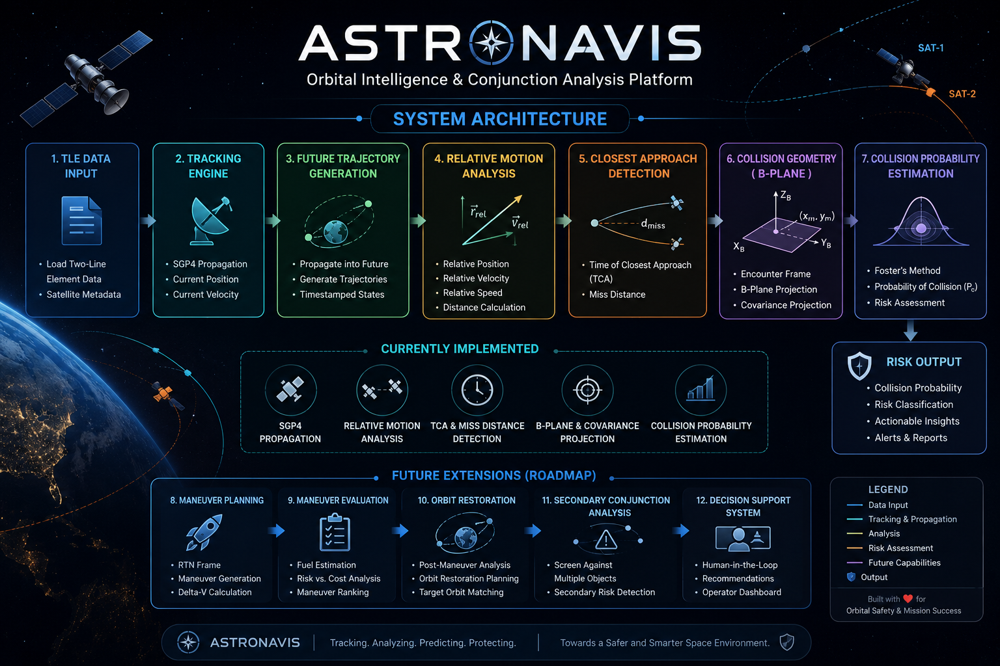

# AstroNavis
🛰️ AstroNavis — A "Google Maps for Satellites" orbital intelligence platform that tracks space objects, predicts conjunction events, analyzes collision risks, and evaluates fuel-efficient avoidance maneuvers with secondary collision risk assessment.

# 🚀 AstroNavis

> An Orbital Intelligence & Conjunction Analysis Platform

[]()
[]()
[]()

---

## 🌍 Overview

AstroNavis is a deep-tech aerospace project focused on orbital intelligence, satellite tracking, conjunction assessment, collision probability estimation, and future maneuver planning.

The long-term vision is to build a system that functions as a **"Google Maps for Satellites"**, enabling operators to understand satellite motion, identify collision risks, evaluate avoidance strategies, and analyze secondary conjunctions before executing maneuvers.

---

## 🖼️ System Overview

> 📌 Add a high-level architecture diagram here.



---

## 🎯 Project Goals

AstroNavis aims to provide:

- Real-time satellite tracking
- Orbit propagation using SGP4
- Relative motion analysis
- Closest approach detection
- Collision probability estimation
- Risk assessment
- Maneuver planning
- Fuel-aware maneuver evaluation
- Orbit restoration analysis
- Secondary conjunction analysis

---

## ⚠️ The Problem

The number of active satellites and orbital debris objects is increasing rapidly.

This creates several challenges:

- Increasing collision risk
- Large volumes of conjunction alerts
- Expensive analysis workflows
- Complex maneuver decisions
- Fuel constraints
- Secondary collision risks

Most systems focus on avoiding a single conjunction event.

AstroNavis aims to evaluate the **broader consequences** of an avoidance maneuver and eventually assess whether a maneuver introduces new collision risks elsewhere in the orbital environment.

---

## 🏗️ Current System Architecture

```text
TLE Data
    ↓
Tracking Engine
    ↓
SGP4 Orbit Propagation
    ↓
Future Trajectory Generation
    ↓
Relative Motion Analysis
    ↓
Closest Approach Detection
    ↓
Collision Geometry Analysis
    ↓
Collision Probability Estimation
```

---

## 📦 Current Features

### Tracking Engine

- Load satellites from TLE data
- SGP4 propagation
- Current position calculation
- Current velocity calculation
- Future trajectory generation

### Conjunction Analysis Engine

- Relative Position
- Relative Velocity
- Relative Speed
- Distance Calculation
- Dot Product Analysis
- Time of Closest Approach (TCA)
- Miss Distance Detection

### Collision Risk Engine

- Hard Body Radius (HBR)
- Encounter Frame Construction
- B-Plane Projection
- Covariance Projection
- Foster-style Collision Probability Estimation

---

## 📊 Example Workflow

```text
ISS
   +
Hubble
   ↓
SGP4 Propagation
   ↓
Future Trajectory Generation
   ↓
Relative Motion Analysis
   ↓
Closest Approach Detection
   ↓
Collision Probability Calculation
```

---

## 🖼️ Example Output

> 📌 Add screenshots from your terminal output here.

### Satellite Tracking


### Closest Approach Analysis


### Collision Probability Estimation


---

## 🛠️ Tech Stack

### Core Technologies

- Python
- NumPy
- SGP4

### Visualization (Planned)

- Plotly
- CesiumJS

### Backend (Planned)

- FastAPI

### Future Infrastructure

- PostgreSQL
- Redis
- Docker

---

## 📂 Project Structure

```text
AstroNavis/
│
├── src/
│   ├── main.py
│   ├── tracker.py
│   ├── conjunction.py
│   └── maneuver.py
│
├── data/
│   └── tle/
│
├── docs/
│
├── tests/
│
└── README.md
```

---

## 🔬 Current Implemented Modules

| Module | Status |
|----------|----------|
| TLE Loading | ✅ |
| SGP4 Propagation | ✅ |
| Relative Motion Analysis | ✅ |
| Future Propagation | ✅ |
| TCA Detection | ✅ |
| Miss Distance Detection | ✅ |
| HBR Estimation | ✅ |
| Encounter Frame | ✅ |
| B-Plane Projection | ✅ |
| Collision Probability | ✅ |

---

## 🚧 Roadmap

### Phase 1 — Tracking Engine

- [x] TLE Parsing
- [x] Orbit Propagation
- [x] Relative Motion Analysis
- [x] Closest Approach Detection

### Phase 2 — Conjunction Assessment

- [x] HBR Estimation
- [x] B-Plane Projection
- [x] Collision Probability Engine

### Phase 3 — Maneuver Intelligence

- [ ] RTN Frame Analysis
- [ ] Maneuver Generation
- [ ] Fuel Estimation
- [ ] Maneuver Evaluation
- [ ] Maneuver Ranking

### Phase 4 — Advanced Orbital Intelligence

- [ ] Orbit Restoration Planning
- [ ] Multi-Object Conjunction Screening
- [ ] Secondary Conjunction Analysis
- [ ] Human-in-the-Loop Decision Support

---

## 🌟 Key Differentiator

Most conjunction assessment systems stop after identifying a collision risk.

AstroNavis aims to go further.

### Secondary Conjunction Analysis

Before recommending a maneuver, AstroNavis will evaluate whether the proposed trajectory introduces a new conjunction risk with another satellite or debris object.

```text
Original Collision
        ↓
Avoidance Maneuver
        ↓
Secondary Risk Check
        ↓
Safe Recommendation
```

This capability is planned as a core differentiator of the platform.

---

## 📈 Future Vision

The long-term objective is to develop AstroNavis into a scalable orbital intelligence platform capable of:

- Space situational awareness
- Conjunction assessment
- Collision avoidance planning
- Mission preservation analysis
- Autonomous recommendation support

while maintaining human approval in the final decision-making loop.

---

## 👨‍💻 Author

**Prince Naroliya**

Founder & Developer of AstroNavis

Building the next generation of orbital intelligence systems.

---
